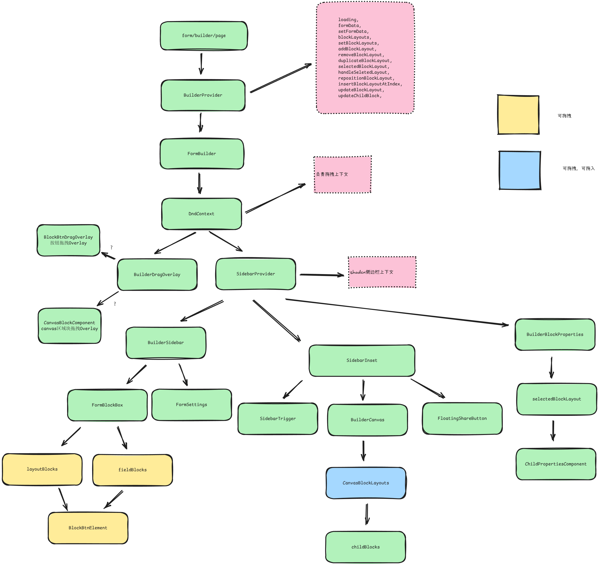

# AI Form Editor

## 🚀 Tools & Technologies

This project is built using:

- 
- 
- 
- 
- 
- 

---

## 🔄 Get Started

### 1. Set Up Environment Variables

Create a `.env` file in the root of your project and add the following:

```plaintext
KINDE_SITE_URL=<your-kinde-site-url>
KINDE_POST_LOGOUT_REDIRECT_URL=<your-post-logout-url>
KINDE_POST_LOGIN_REDIRECT_URL=<your-post-login-url>
NEXT_PUBLIC_APP_URL=<your-app-url>

DATABASE_URL=<direct-database-url>
DIRECT_DATABASE_URL=<direct-database-url>

NEXT_PUBLIC_GEMINI_API_KEY=<gemini-api-key>

NEXT_PUBLIC_APP_URL="http://localhost:3000"

```

### 2. Get Database URLs from Neon

[Neon Link](https://neon.tech)

### 3. Run the Development Server

Start the development server:

```bash
npm run dev
```

Access the application at `http://localhost:3000`.

---

## 🎥 Author on YouTube

欢迎访问项目作者的 YouTube 频道，获取更多相关内容与教程：

[](https://www.youtube.com/@techwithemmaofficial)

## 🗂 Project Structure

下图展示了本项目 dashboard 整体结构，便于快速理解各个模块之间的关系：


